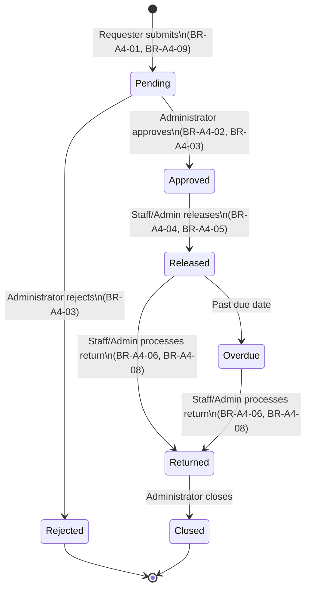

# Lab Asset Register — Role-Based Asset Transaction and Approval Management

System for role-based lab asset borrowing, approval workflow, and audit logging (GitHub Pages + Supabase).

# Entity-Relationship Diagram

**Entity-Relationship Diagram**

# Use Case Diagram

## 4. Role-Permission Matrix

| Function                               | Administrator | Laboratory Staff | Requester / Viewer |
|-----------------------------------------|:---:|:---:|:---:|
| View available equipment                | ✅ | ✅ | ✅ |
| Add / edit / delete equipment           | ✅ | ❌ | ❌ |
| Submit a borrowing request              | ✅ | ✅ | ✅ |
| Approve / reject a borrowing request    | ✅ | ❌ | ❌ |
| Approve their **own** request           | ❌ (BR‑A4‑02) | ❌ | ❌ |
| Release approved equipment              | ✅ | ✅ | ❌ |
| Process a return                        | ✅ | ✅ | ❌ |
| Submit a maintenance request            | ✅ | ✅ | ❌ |
| Resolve a maintenance request           | ✅ | ❌ | ❌ |
| View own request status/history         | ✅ | ✅ | ✅ |
| View **all** requests                   | ✅ | ✅ | ❌ (own only) |
| Manage users / roles                    | ✅ | ❌ | ❌ |
| View audit logs                         | ✅ | ❌ | ❌ |

Enforced at two levels: the **interface** (navigation and buttons are shown/hidden per role in `js/app.js`) and the **database** (Row Level Security policies + `security definer` RPC functions in `sql/schema.sql`), so a user can't bypass the UI to perform an action their role doesn't allow.

## 5. Workflow Diagram

Every transition writes an `audit_logs` entry (BR-A4-10). Rejected requests have no path to Released (BR-A4-07) — the state machine makes that transition structurally impossible.

## 6. Business Rules

| ID | Rule | Where it's enforced |
|----|------|----------------------|
| BR-A4-01 | Only available equipment may be requested. | `submit_borrowing_request()` checks `equipment.status = 'available'` before inserting. |
| BR-A4-02 | Staff/Admin cannot approve their own request. | `approve_request()` raises an exception if `requester_id = auth.uid()`. |
| BR-A4-03 | Only Administrator may approve or reject requests. | `approve_request()` / `reject_request()` call `is_admin()` and raise if false; no direct table UPDATE policy exists on `borrowing_requests`, so only these functions can change status. |
| BR-A4-04 | Only Approved requests may be released. | `release_equipment()` checks `status = 'approved'` before proceeding. |
| BR-A4-05 | Released equipment becomes Borrowed. | `release_equipment()` sets `equipment.status = 'borrowed'` in the same transaction. |
| BR-A4-06 | Returned equipment becomes Available unless damaged. | `return_equipment()` sets `equipment.status` to `'available'` or `'damaged'` based on the damaged flag. |
| BR-A4-07 | Rejected requests cannot be released. | Structurally guaranteed: `release_equipment()` only accepts `status = 'approved'`, and a rejected request can never reach `approved`. |
| BR-A4-08 | Returned transactions cannot be processed twice. | `return_equipment()` only accepts `status in ('released','overdue')`; a second call on an already-returned request fails. |
| BR-A4-09 | Equipment under Maintenance cannot be borrowed. | Same `status = 'available'` gate as BR-A4-01 — maintenance equipment is never `'available'`. |
| BR-A4-10 | Sensitive operations must be logged. | Every workflow RPC calls `log_action()`, writing to `audit_logs`. Direct inserts into `audit_logs` are blocked by RLS — only `log_action()` can write. |

All rules are enforced as PostgreSQL `security definer` functions, not just frontend checks, so they hold even if the API is called directly, bypassing the web UI.

## 7. Audit-Log Screenshot

<!-- Paste your Audit Log tab screenshot here, e.g.:  -->

## 8. Functional Test Results

| Test ID | Scenario | Expected Result | Result |
|---|---|---|---|
| TC-A4-01 | Viewer attempts to open Admin page | Access denied | ☐ |
| TC-A4-02 | Staff submits request | Request saved as Pending | ☐ |
| TC-A4-03 | Administrator approves request | Status becomes Approved; audit log created | ☐ |
| TC-A4-04 | Administrator rejects request | Status becomes Rejected | ☐ |
| TC-A4-05 | Attempt to release rejected request | Operation blocked | ☐ |
| TC-A4-06 | Release approved equipment | Equipment becomes Borrowed | ☐ |
| TC-A4-07 | Return released equipment | Equipment returns to appropriate status | ☐ |
| TC-A4-08 | Check audit log after approval | Approval entry is visible | ☐ |
| TC-A4-09 | Staff attempts restricted delete | Operation blocked | ☐ |
| TC-A4-10 | Logout and open protected page | Redirected to login / access denied | ☐ |

Full details on how each test was triggered: [`docs/functional-test-results.md`](docs/functional-test-results.md)