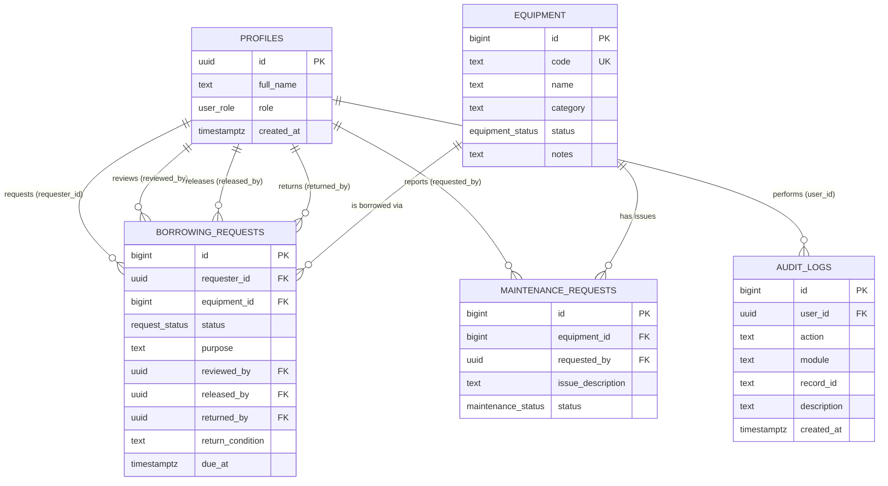

# Entity-Relationship Diagram

```mermaid
erDiagram
    PROFILES ||--o{ BORROWING_REQUESTS : "requests (requester_id)"
    PROFILES ||--o{ BORROWING_REQUESTS : "reviews (reviewed_by)"
    PROFILES ||--o{ BORROWING_REQUESTS : "releases (released_by)"
    PROFILES ||--o{ BORROWING_REQUESTS : "returns (returned_by)"
    PROFILES ||--o{ MAINTENANCE_REQUESTS : "reports (requested_by)"
    PROFILES ||--o{ AUDIT_LOGS : "performs (user_id)"
    EQUIPMENT ||--o{ BORROWING_REQUESTS : "is borrowed via"
    EQUIPMENT ||--o{ MAINTENANCE_REQUESTS : "has issues"

    PROFILES {
        uuid id PK
        text full_name
        user_role role
        timestamptz created_at
    }
    EQUIPMENT {
        bigint id PK
        text code UK
        text name
        text category
        equipment_status status
        text notes
    }
    BORROWING_REQUESTS {
        bigint id PK
        uuid requester_id FK
        bigint equipment_id FK
        request_status status
        text purpose
        uuid reviewed_by FK
        uuid released_by FK
        uuid returned_by FK
        text return_condition
        timestamptz due_at
    }
    MAINTENANCE_REQUESTS {
        bigint id PK
        bigint equipment_id FK
        uuid requested_by FK
        text issue_description
        maintenance_status status
    }
    AUDIT_LOGS {
        bigint id PK
        uuid user_id FK
        text action
        text module
        text record_id
        text description
        timestamptz created_at
    }
```
