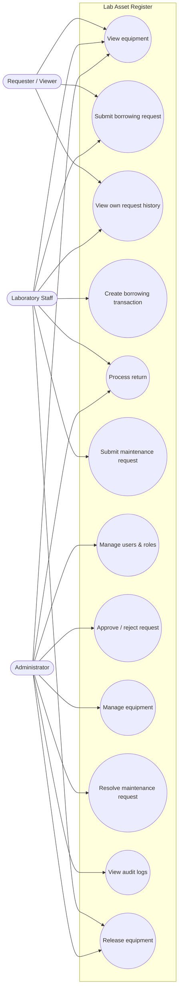

# Use Case Diagram

```mermaid
flowchart LR
    Admin([Administrator])
    Staff([Laboratory Staff])
    Req([Requester / Viewer])

    subgraph System["Lab Asset Register"]
        UC1((View equipment))
        UC2((Submit borrowing request))
        UC3((View own request history))
        UC4((Create borrowing transaction))
        UC5((Process return))
        UC6((Submit maintenance request))
        UC7((Manage users & roles))
        UC8((Approve / reject request))
        UC9((Manage equipment))
        UC10((Resolve maintenance request))
        UC11((View audit logs))
        UC12((Release equipment))
    end

    Req --> UC1
    Req --> UC2
    Req --> UC3

    Staff --> UC1
    Staff --> UC2
    Staff --> UC3
    Staff --> UC4
    Staff --> UC5
    Staff --> UC6
    Staff --> UC12

    Admin --> UC1
    Admin --> UC7
    Admin --> UC8
    Admin --> UC9
    Admin --> UC10
    Admin --> UC11
    Admin --> UC12
    Admin --> UC5
```
