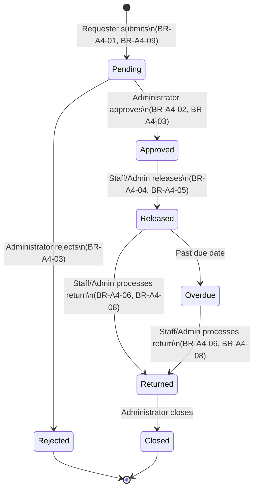

# Borrowing Approval Workflow

Every transition writes an `audit_logs` entry (BR-A4-10). Rejected requests have no path to Released (BR-A4-07) — the state machine makes that transition structurally impossible.
